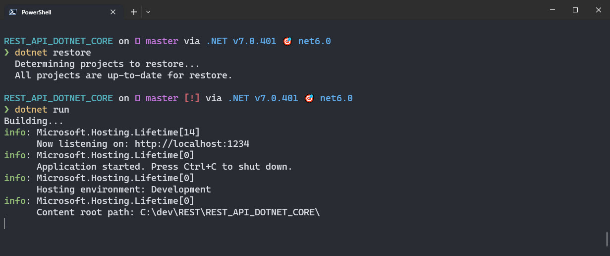
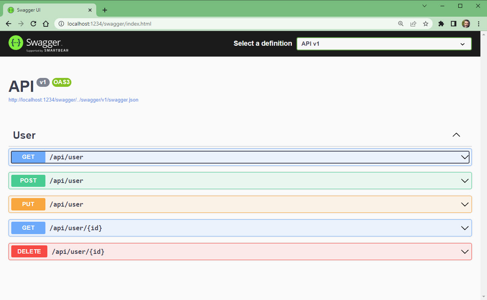
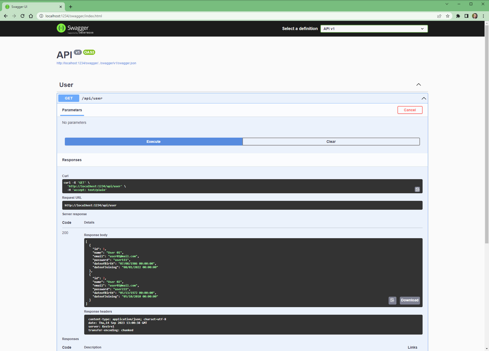

## POC | Simple WebAPI 

- REST API with swagger.json for endpoint documentation  
- SQLSERVER Database (Setup_Database.sql)
- Uses one T-SQL Stored Procedure for CRUD 
- Uses Dapper for data access
- No ORM or Entity Framework used 


## Setup

- Create a database in SQLSERVER
- Run the Setup_Database.sql script to create the table and stored procedure
- Update the connection string in appsettings.json
	- Run the project usign V
	- Navigate to https://localhost:5001/swagger/index.html to view the endpoints
- Use the HTTP POST endpoint to create a new record
- Use the HTTP GET endpoint to retrieve a record
- Use the HTTP PUT endpoint to update a record
- Use the HTTP DELETE endpoint to delete a record

 

## MSSQL Server in Docker Container 

```powershell
# Download the latest SQL Server 2019 image from Microsoft Container Registry
docker run -d --name sqlserver -e "ACCEPT_EULA=Y" -e "SA_PASSWORD=Password123" -p 1433:1433 mcr.microsoft.com/mssql/server:2019-latest

# Connect to the SQL Server instance and run the following commands
sqlcmd -S localhost,1433 -U sa -P Password123 -i .\setup_database.sql
sqlcmd -S localhost,1433 -U sa -P Password123 -Q "SELECT count(*) as [TestCount]  FROM [StudentDB].[dbo].[StudentDetails]"
```

## update the connectionstring to sqlserver in appsettings.json

```json
{
  "ConnectionStrings": {
    "dbConnection": "Server=localhost,1433;Database=StudentDB;User Id=sa;Password=Password123;"
  }
}
```


## start the dotnet core WebAPI

```powershell
# start the dotnet core WebAPI
dotnet restore
dotnet watch run
```




## Test the WebAPI with swagger




## Test the WebAPI with HTTP Get

- http://localhost:1234/api/user
- http://localhost:1234/api/user/1





