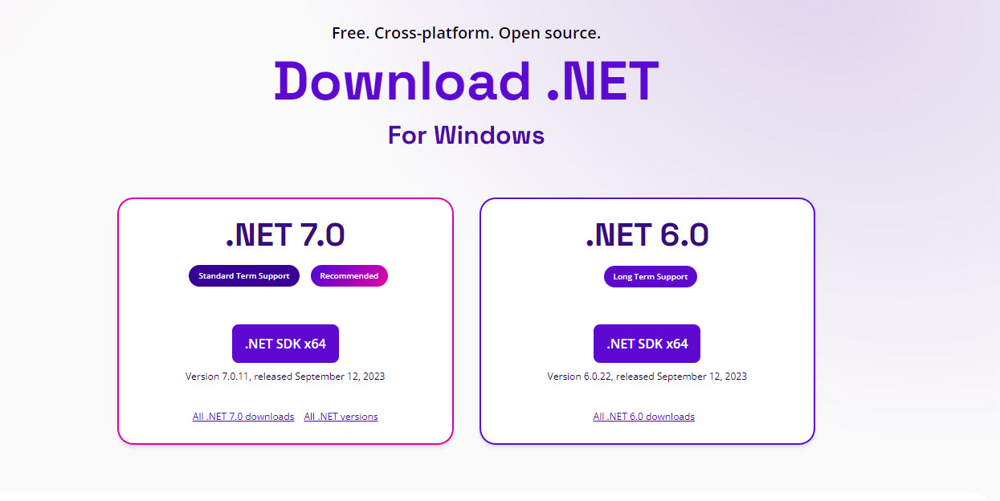

## dotnet-cli webapi 

- The simplest way to create a new webapi project is to use the dotnet-cli. 
- The dotnet-cli is a command line tool that is installed with the .NET Core SDK.


## How to install dotnet core on Windows
- Download and install the latest .NET Core SDK from https://dotnet.microsoft.com/download




## Verify the installation

```powershell
dotnet --version
```

## list all installed SDKs
```powershell
dotnet --list-sdks
```

## How to configure the desired dotnet version | Switch between dotnet core SDK versions
```powershell 
# insure you have a global.json file created on the root of the project folder
# varify the sdk version is matching the desired version 
dotnet new globaljson # The template "global.json file" was created successfully.

# the content of global.json can be changed to any valid installed sdk
cat global.json 
{
  "sdk": {
    "version": "3.0.100"
  }
}

# expecting sdk version 3
dotnet --version # should match global.json # 3.0.100

# More info how dotnet and global.json works:
https://aka.ms/dotnet/sdk-not-found
```


## dotnet new webapi from scratch | the desired sdk version 6
```powershell	
dotnet new globaljson # The template "global.json file" was created successfully.

# the content of global.json can be changed to any valid installed sdk
cat global.json 
{
  "sdk": {
    "version": "6.0.0"
  }
}
dotnet --version # expecting 6.0.0

dotnet new webapi  --name projectName  --no-update-check --framework net6.0  --no-restore  --no-https  --dry-run
```

## dotnet new webapi from scratch | the desired sdk version 7
```powershell	
dotnet new globaljson # The template "global.json file" was created successfully.

# the content of global.json can be changed to any valid installed sdk
cat global.json 
{
  "sdk": {
    "version": "7.0.0"
  }
}
dotnet --version # expecting 7.0.0

dotnet new webapi  --name projectName  --no-update-check --framework net7.0  --no-restore  --no-https  --dry-run
```


## How to restore packages
```powershell   
dotnet restore
```

## How to build
```powershell
dotnet build
```

## How to run
```powershell
dotnet run
```

## How to test
```powershell   
dotnet test
```

## How to Call the API from a browser 
- http://localhost:5132/swagger/index.html 
- http://localhost:5132/WeatherForecast

