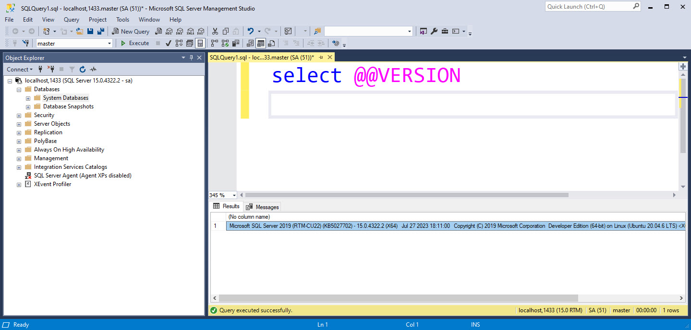

# Why use SQL Server?

- SQL Server is a relational database management system (RDBMS) developed by Microsoft.
- SQL Server is a database server, it is a software product whose primary function is to store and retrieve data as requested by other software applications, be it those on the same computer or those running on another computer across a network (including the Internet).

- For development and testing purposes, you can use container technology to run SQL Server in a Docker container on your local machine. 


## MSSQL as container 

- Why use Docker? 
- Docker is a set of platform as a service (PaaS) products that use OS-level virtualization to deliver software in packages called containers.
- Containers are isolated from one another and bundle their own software, libraries and configuration files; they can communicate with each other through well-defined channels.
- All containers are run by a single operating system kernel and are thus more lightweight than virtual machines.
- Containers are created from images that specify their precise contents.
- Images are often created by combining and modifying standard images downloaded from public repositories.

- Download and install Docker Desktop from https://www.docker.com/products/docker-desktop

- [SQL Server on Linux](https://learn.microsoft.com/en-us/sql/linux/sql-server-linux-overview?view=sql-server-ver16)
- [Available Microsoft SQL Server - Ubuntu based images](https://mcr.microsoft.com/en-us/product/mssql/server/about)


## How to run SQL Server in a Docker container | Data will be lost on restart the container
- Open a command prompt and run the following command to download the SQL Server 2019 image from Docker Hub:
- Run the following command to start a new container from the SQL Server image:

```powershell
docker run -d --name sqlserver -e "ACCEPT_EULA=Y" -e "SA_PASSWORD=Password123" -p 1433:1433 mcr.microsoft.com/mssql/server:2019-latest
```

## How to run SQL Server in a Docker container and using volume to store data and log on disk | No Data Loss 
- [Youtube > How to run SQLServer as Container on windows with Data volume mapping](https://www.youtube.com/watch?v=fFpDf5si_Hw)

```powershell
docker run -d --name sqlserver -e "ACCEPT_EULA=Y" -e "SA_PASSWORD=Password123" -p 1433:1433 -v 'c:/dockervolumes/sqlserver/data':/var/opt/mssql/data -v 'c:/dockervolumes/sqlserver/log':/var/opt/mssql/log -v 'c:/dockervolumes/sqlserver/secrets':/var/opt/mssql/secrets mcr.microsoft.com/mssql/server:2019-latest
```





## This image 'jalalhejazi/microservice_sqlserver:latest' includes data and stored procedures ready to use 

```powershell
# docker run ready to go image 
docker run -d --name sqlserverWithData -e "ACCEPT_EULA=Y" -e "SA_PASSWORD=Djakp88t" -p 1433:1433 -v c:/dockervolumes/sqlserver/data:/var/opt/mssql/data -v c:/dockervolumes/sqlserver/log:/var/opt/mssql/log -v c:/dockervolumes/sqlserver/secrets:/var/opt/mssql/secrets jalalhejazi/microservice_sqlserver:latest


# Verify Microsoft SQL Server 2017 (RTM-CU11) (KB4462262) - 14.0.3038.14 (X64)
SQLCMD -S localhost,1433 -U sa -P Djakp88t -d master -Q 'select @@version'


# verify stored-procedure can generate JSON output
SQLCMD -S localhost,1433 -U sa -P Djakp88t -d AdventureworksLT2017 -Q 'exec API.Get_Product_Info'
```